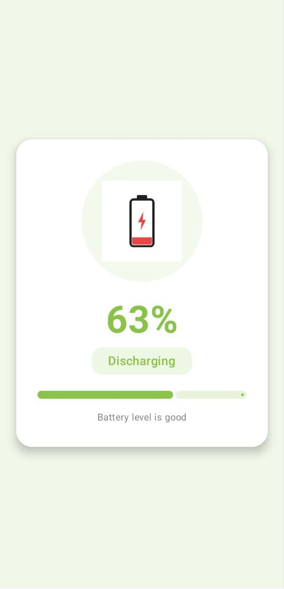
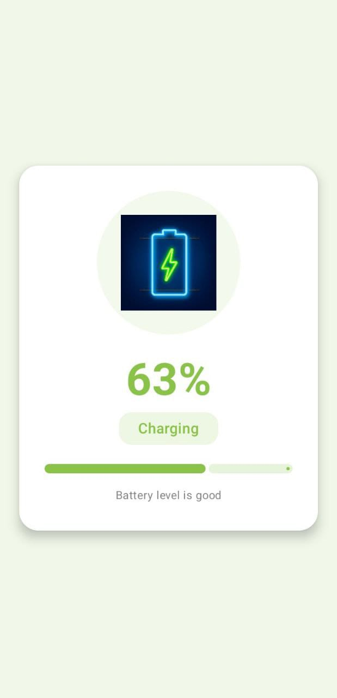

📱 Features
✔️ Real-time Battery Monitoring

Uses Intent.ACTION_BATTERY_CHANGED to get:

Battery percentage

Charging / Discharging / Full status

✔️ Beautiful UI with Jetpack Compose

Dynamic background colors based on battery level

Smooth progress indicator

Battery icons for charging, discharging, and full

Clean card layout with rounded corners and shadows

✔️ Dynamic Color Logic

Battery level changes the UI theme:

Battery Level	Color	Meaning
80–100%	Green	Healthy battery
50–79%	Light Green	Good
20–49%	Amber	Moderate
0–19%	Red	Low battery

🧩 Tech Stack

Kotlin

Jetpack Compose

Material 3 Components

BroadcastReceiver

BatteryManager

Composable UI Architecture

## 📸 App Screenshots

  
  

